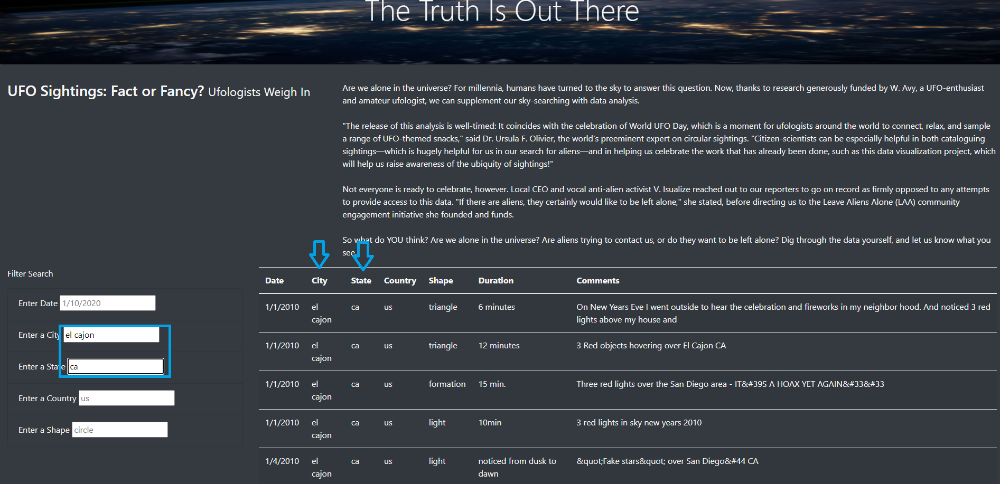

# UFOs
## Overview

The purpose of this project is to create a responsive webpage- using html, javascript, and css- to house a dynamic table of UFO sighting data.  In the final steps of this project, we add the ability to filter the table and data by several criteria, including date, location, and the nature of the sighting.

## Results

Upon first opening the webpage, the table will show unfiltered data.  In order to apply filters, you only need to type into the "Filter Search" area on the left, shown below. 

 Find the relevent filter and type in your search criteria.  Hit the enter key, or simply click off the filter text box, and the table will automatically filter according to your desired restrictions.

For example, to find all the sightings in El Cajon, California, I type the city "el cajon" in the "City" field, and the state code "ca" in the "State" field, shown below.

 

 
 
## Summary

As of right now the webpage is limited by case and size.  Firstly, the code is case-sensitive, meaning if one tries to filter by "CA" instead of "ca", they will receive no results.
We could add code to make the entries case-agnostic.
Secondly, the table only pulls data from a given, static data file, which includes only the first two weeks of 2010.  This webpage would be greatly improved if this data could be updated with future sightings as they are reported.

Other features which could improve this dynamic webpage:
- Adding a sort-by function to the columns of the table
- Adding a map, to see the locations of the filtered sightings
